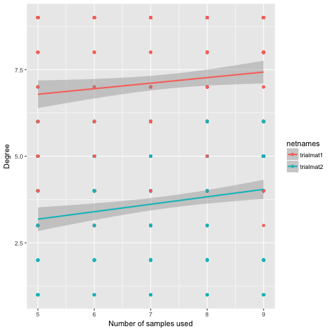

Analysing how network conclusions change when the number of nodes collected is altered

This package takes matrixes of interactions, which are formatted in columns as 'speciesname-sampleID', then uses a randomly selected subset of a given number of them to make a matrix. The columns of the resulting matrix are then collapsed by species, and your desired metric from the bipartite package is then calculated. As the selection of nodes retained are chosen randomly, it is best to perform multiple iterations of the analysis. 

The function used by the user can accept either individual matrixes, or a list of matrixes. If using a list, please ensure your list items are named.

(Dave Hemprich-Bennett, hemprich.bennett@gmail.com, @hammerheadbat)


# Example vignette
```
library(devtools)
install_github('hemprichbennett/netReducer')

library(netReducer)

#Generate two example matrixes to analyse
trialmat1 <- matrix(sample(c(0,1),100, replace = T, prob = c(0.75, 0.25), nrow = 10)
colnames(trialmat1) <- c('Hice-001', 'Hice-002',	'Rhtr-001',	'Rhtr-008',	 'Keha-0005', 'Keha-01A', 'Hice-005', 'Rhtr-010', 'Hidi-001', 'Hice-087')
#trialmat1
trialmat2 <- matrix(sample(c(0,1),100, replace = T, prob = c(0.85, 0.15)), nrow = 10)
colnames(trialmat2) <- c('Hidy-001', 'Hidy-002',	'Rhtr-001',	'Rhtr-008',	 'Keha-0005', 'Keha-01A', 'Hidy-005', 'Rhtr-010', 'Hidi-001', 'Hidy-087')


#The matrixes can be analysed individually, or a series of them can be analysed together as a list
input_list <- list('trialmat1' = trialmat1, 'trialmat2' = trialmat2)


#Here a single matrix is analysed
one_net_example <- netreducing(input = trialmat1, input_type = 'matrix', n_iterations = 10, min_nodes = 5, metric_chosen = 'connectance', type_chosen = 'network')


#Here multiple matrixes in a list are analysed
two_net_example <- netreducing(input = input_list, input_type = 'list', n_iterations = 10, min_nodes = 5, metric_chosen = 'degree', type_chosen = 'species', level = 'higher')


#Plot the outputs
library(ggplot2)
ggplot(two_net_example, aes(x=n_used, y= metricval, colour = netnames))+ geom_point()+ geom_smooth(method = lm)+
  labs(x = 'Number of samples used', y = 'Degree')


```
